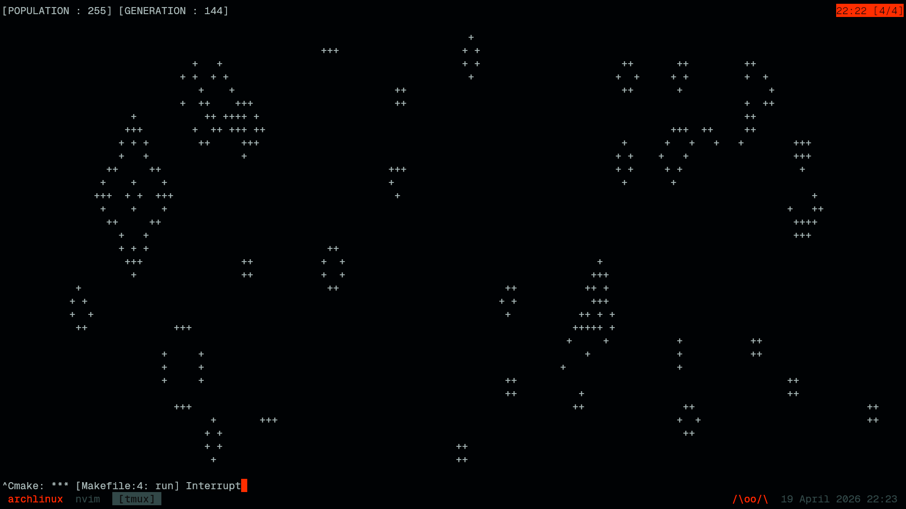

# Conway's Game Of Life



This repository contains a lightweight, terminal-based implementation of **Conway’s Game of Life** written in pure C. It utilizes standard Unix system calls to detect terminal dimensions and render the cellular automaton directly in your command line.

#### Rules of the Game
The simulation follows these four rules:
1.  **Underpopulation:** Any live cell with fewer than two live neighbors dies.
2.  **Survival:** Any live cell with two or three live neighbors lives on to the next generation.
3.  **Overpopulation:** Any live cell with more than three live neighbors dies.
4.  **Reproduction:** Any dead cell with exactly three live neighbors becomes a live cell.


#### How to Build and Run
1.  **Compile:**
    Use `gcc` (or any standard C compiler):
    ```bash
    gcc -o gol main.c
    ```
2.  **Execute:**
    ```bash
    ./gol
    ```

#### Configuration
You can modify the behavior of the simulation by changing the `#define` macros at the top of the source code:
* `SLEEP`: Adjusts the speed of the simulation (in microseconds).
* `POP_FACTOR`: Adjusts the initial density of the population (default is 35%).
